# IBM Datacap Application Generator — Plan

> Target: IBM Datacap **9.1.10**
> Knowledge base: `knowledge-base/`
> Templates: `templates/`
> All generated artifacts use the templates as the base; nothing is created from scratch.
>
> **Plan version: 1.3**
> Changelog:
> - v1.1: Fixed E1–E5 (flowchart path gaps, collection.xml custom-action entry, Numeric validation action, missing generation logic for `integrityBranch` and `batchSplit`). Added G1–G6 gaps (Extraction.rul, output directory creation, missing KB reference, resume logic). Added I3 (`CreateDocs` task question).
> - v1.2: Added `templates/app-config/AppName.app`, `templates/gitignore.txt`. Added `knowledge-base/datacap-watsonx-ai-integration.md`. Plan template table + KB reference table updated.
> - v1.3: Added Phase 3 — MCP-driven incremental and end-to-end testing using `mcp-datacap-server`. Flowchart extended, Execution Protocol STEP 6 and STEP 7 added, Deployment Checklist MCP Testing section added.

---

## Overview

The generator follows a **two-phase model**:

1. **Intake Phase** — a structured question-and-answer session that builds a complete `requirements.json` manifest.
2. **Generation Phase** — deterministic file generation driven entirely by that manifest, using the templates as base files.

Every decision made during intake maps directly to a named field in `requirements.json`. Every generated file traces back to at least one intake answer. Nothing is generated speculatively.

```
Intake (Q&A)
   │
   ▼
requirements.json          ← single source of truth
   │
   ├── SetupDCO XML         (from templates/dco-xml/AppName.xml)
   ├── collection.xml       (from templates/rulesets/collection.xml)
   ├── <Task>.rul files     (generated per workflow task)
   ├── AppName.app          (generated from intake answers)
   ├── CustomActions.cs     (from templates/custom-action/CustomActions.cs)
   ├── CustomActions.csproj (from templates/custom-action/CustomActions.csproj)
   ├── CustomActions.rrx    (from templates/custom-action/CustomActions.rrx)
   └── README.md            (generated deployment guide)
```

---

## Flowchart

```mermaid
flowchart TD
    START([🚀 Start Generator]) --> EXISTING{output/<AppName>/\nrequirements.json\nexists?}

    EXISTING -->|Yes| RESUME{Resume or\nstart fresh?}
    EXISTING -->|No| S1

    RESUME -->|Resume| VALIDATE
    RESUME -->|Fresh| S1

    subgraph INTAKE ["⬛ PHASE 1 — INTAKE"]
        S1["📋 Section 1\nApplication Identity\n(name, server, DSNs, path)"]
        S2["🗂 Section 2\nDocument Hierarchy\n(documents → pages → fields\nline items, dictionaries, lookups)"]
        S3["⚙ Section 3\nWorkflow Design\n(input method, verification,\nRulerunner, branching, splitting)"]
        S4["🔎 Section 4\nRecognition Config\n(OCR engine, ICR, barcodes,\nlocale, zones vs full-page)"]
        S5["🔗 Section 5\nIntegration Points\n(export targets, lookup DBs,\ncustom C# actions)"]
        S6["📊 Section 6\nNon-Functional Requirements\n(volume, HA, secrets, env)"]

        S1 --> S2 --> S3 --> S4 --> S5 --> S6
    end

    S6 --> WRITE_REQ[/"✍ Write\nrequirements.json"/]
    WRITE_REQ --> VALIDATE

    subgraph VALIDATION ["🔍 PRE-GENERATION VALIDATION"]
        VALIDATE["Run validation checks\n(app name format, ≥1 document,\neach page has fields,\npageIDMethod set,\ninputMethod set, etc.)"]
        VALIDATE --> ERRCHECK{Errors?}
        ERRCHECK -->|🔴 Errors| FIX["Present errors\n→ User corrects intake\n→ Re-validate"]
        FIX --> ERRCHECK
        ERRCHECK -->|🟡 Warnings only| WARN["Present warnings\n→ User confirms or adjusts"]
        WARN --> GENSTART
        ERRCHECK -->|✅ Clean| GENSTART
    end

    subgraph GENERATION ["⬛ PHASE 2 — GENERATION  (output/<AppName>/)"]
        GENSTART(["▶ Begin generation"])

        GENSTART --> MKDIR["📁 Create output directories\ndco_AppName/rules/\nCustomActions/ if needed"]
        MKDIR --> G1["📄 dco_&lt;App&gt;/&lt;App&gt;.xml\n(SetupDCO hierarchy)\nFROM: templates/dco-xml/AppName.xml"]
        MKDIR --> G2["📄 rules/collection.xml\nFROM: templates/rulesets/collection.xml"]

        G1 --> G3
        G2 --> G3

        G3["📄 rules/PageID.rul\n(per pageIDMethod:\nfingerprint / barcode /\ntextmatch / pattern / manual)"]
        G3 --> G4["📄 rules/Recognition.rul\n(OCR_S / OCR_A / ICR_C\nbarcodes, voting, PDF)"]
        G4 --> G4B["📄 rules/Extraction.rul\n(Locate text-match extraction\nfor fullpage OCR mode)"]
        G4B --> G5["📄 rules/Validation.rul\n(per field: required, date,\nnumeric, currency, regex, dict, lookup)"]
        G5 --> G6["📄 rules/Export.rul\n(per export target:\nFileNet P8 / IBM CM / SharePoint /\nCMIS / ODBC / XML / CSV / REST)"]

        G6 --> COND_CONV{inputMethod\n= pdf_convert?}
        COND_CONV -->|Yes| G7["📄 rules/Convert.rul\n(PDFDocumentToImage,\nresolution, compression)"]
        COND_CONV -->|No| COND_IMG

        G7 --> COND_IMG{imageEnhancement\n= true?}
        COND_IMG -->|Yes| G8["📄 rules/ImageEnhance.rul\n(LoadSettings_FingerprintID\nImageEnhance)"]
        COND_IMG -->|No| COND_MAN

        G8 --> COND_MAN{manualPageID\n= true?}
        COND_MAN -->|Yes| G9["📄 rules/ManualPageID.rul\n(Task_RaiseCondition)"]
        COND_MAN -->|No| COND_SPLIT

        G9 --> COND_SPLIT{batchSplit\n= true?}
        COND_SPLIT -->|Yes| G10["📄 rules/BatchSplit.rul\n(SplitBatch +\nTask_RaiseCondition)"]
        COND_SPLIT -->|No| GAPP

        G10 --> GAPP["📄 &lt;AppName&gt;.app\n(INI format: paths, DB DSNs,\nserver, secrets via @APPVAR)"]

        GAPP --> COND_CA{customActions\n.required = true?}
        COND_CA -->|Yes| GCA1["📄 CustomActions.cs\nFROM: templates/.../CustomActions.cs\n(namespace, method stubs per action,\nlevel guards, logging, external call boilerplate)"]
        GCA1 --> GCA2["📄 CustomActions.csproj\nFROM: templates/.../CustomActions.csproj\n(x86, net48, COM-visible, post-build copy)"]
        GCA2 --> GCA3["📄 CustomActions.rrx\nFROM: templates/.../CustomActions.rrx\n(Action elements per action[k] with level)"]
        GCA3 --> COND_README
        COND_CA -->|No| COND_README

        COND_README{generateReadme\n= true?}
        COND_README -->|Yes| GREADME["📄 README.md\n(infra checklist, registration,\ncustom actions deploy,\nfingerprint setup, integration test)"]
        COND_README -->|No| SUMMARY
        GREADME --> SUMMARY
    end

    SUMMARY(["✅ Post-generation Summary\nPrint file tree · deployment checklist\nList manual steps:\n• Create fingerprints in Studio\n• Register ODBC DSNs\n• Set up databases\n• Configure Rulerunner"])

    SUMMARY --> MCPQ{Run MCP\ntests now?}
    MCPQ -->|No| DONE([🏁 Done])
    MCPQ -->|Yes| MCPPHASE

    subgraph MCPPHASE ["🧪 PHASE 3 — MCP-DRIVEN TESTING  (mcp-datacap-server)"]
        MCP1["🔍 Verify app registered\nlist-applications\n→ confirm <AppName> present"]
        MCP2["📋 Inspect app structure\nget-workflow · get-task-profiles\nget-dco-definition"]
        MCP3["📦 Incremental ruleset tests\nFor each generated .rul:\n  create-batch (job+task)\n  upload-file (sample image)\n  execute-rules (ruleset name)\n  get-page-file → inspect DCO output\n  release-batch / delete-batch"]
        MCP4["🔁 End-to-end batch test\ncreate-batch → upload-file(s)\nsequential execute-rules per task profile\nget-page-file → assert fields populated\nget-batch-history → verify task progression\nrelease-batch as finished"]
        MCP5["📊 Post-test statistics\nget-statistics (all)\n→ confirm batch/doc/page counts\ndelete-batch (cleanup test data)"]

        MCP1 --> MCP2 --> MCP3 --> MCP4 --> MCP5
    end

    MCP5 --> DONE([🏁 Done])
```



---

## Phase 1 — Intake

The intake is a **structured conversation** divided into 6 sections. Each section must be completed before moving to the next. Unanswered questions block generation of the corresponding artifact.

Intake output is written to: `output/<AppName>/requirements.json`

---

### Section 1 — Application Identity

| # | Question | Key in `requirements.json` | Example |
|---|----------|---------------------------|---------|
| 1.1 | What is the application name? (no spaces, PascalCase) | `app.name` | `InvoiceCapture` |
| 1.2 | What is a short human-readable description of this application? | `app.description` | `Captures and validates supplier invoices` |
| 1.3 | What Datacap server hostname will this run on? | `app.server` | `DCAP-SRV-01` |
| 1.4 | What is the base installation path? | `app.basePath` | `C:\Datacap` |
| 1.5 | What is the Admin DB DSN? | `app.adminDSN` | `InvoiceCapture_Admin` |
| 1.6 | What is the Engine DB DSN? | `app.engineDSN` | `InvoiceCapture_Engine` |

---

### Section 2 — Document Hierarchy

One iteration of questions **per document type**. Repeat until all document types are defined.

#### 2A — Document Types

| # | Question | Key | Example |
|---|----------|-----|---------|
| 2A.1 | How many distinct document types will this application process? | `documents[].count` | `2` |
| 2A.2 | For each document type: What is the name? (PascalCase, no spaces) | `documents[n].name` | `Invoice`, `PurchaseOrder` |
| 2A.3 | For each document type: What is a short description? | `documents[n].description` | `Supplier invoice` |
| 2A.4 | For each document type: Is it **structured** (fixed page order) or **hierarchy-based** (pages identified by type)? | `documents[n].assemblyMode` | `structured` \| `hierarchy` |
| 2A.5 | For each document type: What is the minimum number of pages required? | `documents[n].minPages` | `1` |
| 2A.6 | For each document type: What is the maximum number of pages allowed? (`0` = unlimited) | `documents[n].maxPages` | `10` |

#### 2B — Page Types (per document)

| # | Question | Key | Example |
|---|----------|-----|---------|
| 2B.1 | For this document: how many distinct page types does it have? | `documents[n].pages[].count` | `2` |
| 2B.2 | For each page type: What is the name? (PascalCase) | `documents[n].pages[m].name` | `InvoiceCover`, `LineItemPage` |
| 2B.3 | For each page type: Is this page type **required** in every document instance? | `documents[n].pages[m].required` | `true` \| `false` |
| 2B.4 | For each page type: Can it repeat (appear more than once per document)? | `documents[n].pages[m].repeating` | `true` \| `false` |
| 2B.5 | For each page type: What identification method will be used? | `documents[n].pages[m].pageIDMethod` | `fingerprint` \| `barcode` \| `textmatch` \| `pattern` \| `manual` |

#### 2C — Fields (per page type)

| # | Question | Key | Example |
|---|----------|-----|---------|
| 2C.1 | For this page: how many fields to extract? | `pages[m].fields[].count` | `8` |
| 2C.2 | For each field: What is the field name? (PascalCase) | `fields[k].name` | `InvoiceNumber` |
| 2C.3 | For each field: Data type? | `fields[k].dataType` | `AlphaNumeric` \| `Alphabetic` \| `Numeric` \| `Date` \| `Currency` \| `Boolean` |
| 2C.4 | For each field: Is it required? | `fields[k].required` | `true` \| `false` |
| 2C.5 | For each field: Does it have a display label (for verification UI)? | `fields[k].label` | `Invoice Number` |
| 2C.6 | For each field: Is there a maximum character length? (`0` = no limit) | `fields[k].maxLength` | `20` |
| 2C.7 | For each field: Is there a validation pattern (regex)? | `fields[k].validationPattern` | `^\d{4,10}$` |
| 2C.8 | For each field: Should this field be read-only in the verification UI? | `fields[k].readOnly` | `false` |
| 2C.9 | Does this page have **line items** (repeating child rows)? | `pages[m].hasLineItems` | `true` \| `false` |
| 2C.10 | *(if line items = true)* List the line item child field names and types. | `pages[m].lineItemFields[]` | `[{name: LineAmount, dataType: Numeric}]` |
| 2C.11 | Does any field need a **lookup dictionary** (closed value list)? | `fields[k].dictionary` | `null` \| `"CarTypes.txt"` |
| 2C.12 | Does any field need a **database lookup** for validation? | `fields[k].lookupDSN` | `null` \| `"DSN=Vendors;TABLE=VendorList;COL=VendorName"` |

---

### Section 3 — Workflow Design

| # | Question | Key | Example |
|---|----------|-----|---------|
| 3.1 | What is the **document input method**? | `workflow.inputMethod` | `vscan` \| `email_imap` \| `email_ews` \| `mvscan` \| `remote_scan` \| `pdf_convert` |
| 3.2 | *(if vscan / mvscan)* What is the source folder path? | `workflow.scanSourceDir` | `C:\Datacap\InvoiceCapture\images\input` |
| 3.3 | *(if email)* What is the mailbox / server address? | `workflow.emailServer` | `mail.company.com` |
| 3.4 | *(if pdf_convert)* Should PDFs be rasterized or have embedded images extracted? | `workflow.pdfConversionMethod` | `rasterize` \| `extract` |
| 3.5 | *(if pdf_convert)* What DPI for rasterized output? | `workflow.pdfDPI` | `300` |
| 3.6 | Should page images be **image-enhanced** before fingerprinting (deskew, despeckle)? | `workflow.imageEnhancement` | `true` \| `false` |
| 3.7 | Should unidentified pages be routed to a **manual page ID** task? | `workflow.manualPageID` | `true` \| `false` |
| 3.8 | Should document integrity failures be routed to a **manual integrity fix** task? *(generates `Task_RaiseCondition(IntegrityFailure)` in the PageID ruleset and a branching job router entry)* | `workflow.integrityBranch` | `true` \| `false` |
| 3.9 | For **hierarchy-based** documents: should a dedicated `CreateDocs` task be included between PageID and Recognition to assemble document structure? | `workflow.createDocsTask` | `true` \| `false` |
| 3.10 | Is **human verification** required? | `workflow.verification` | `true` \| `false` |
| 3.11 | *(if verification = true)* Which verification client? | `workflow.verifyClient` | `datacap_web` \| `verifine` \| `aindex` \| `averify` \| `imgenter` |
| 3.12 | *(if verification = true)* Minimum confidence threshold to skip verification (0 = always show)? | `workflow.skipVerifyThreshold` | `85` |
| 3.13 | Should **auto-fingerprint generation** be enabled in the Verify task? | `workflow.autoFingerprint` | `true` \| `false` |
| 3.14 | Should fingerprints be stored in the **database** or in **FPXML files**? | `workflow.fingerprintStorage` | `database` \| `fpxml` |
| 3.15 | Is **Rulerunner background processing** required for any tasks? | `workflow.rulerunnerTasks[]` | `["PageID", "Export"]` |
| 3.16 | Are any tasks run on the **Datacap Web Client** (remote, browser-based)? | `workflow.webTasks[]` | `["Scan", "Verify"]` |
| 3.17 | Is **batch splitting** required? (e.g. route individual documents to separate queues) *(generates `BatchSplit.rul` with `SplitBatch` + `Task_RaiseCondition`)* | `workflow.batchSplit` | `true` \| `false` |
| 3.18 | List any **custom condition flags** needed for job routing (one per line). | `workflow.conditionFlags[]` | `["IntegrityFailure", "HighValueInvoice"]` |

---

### Section 4 — Recognition Configuration

| # | Question | Key | Example |
|---|----------|-----|---------|
| 4.1 | Which **OCR engine** will be used for printed text? | `recognition.ocrEngine` | `ocr_s` \| `ocr_a` \| `ocr_n` |
| 4.2 | Is **handwriting recognition** needed? | `recognition.icrEnabled` | `true` \| `false` |
| 4.3 | *(if icr = true)* Which ICR engine? | `recognition.icrEngine` | `icr_c` \| `icr_p` |
| 4.4 | Is **barcode reading** needed? | `recognition.barcodeEnabled` | `true` \| `false` |
| 4.5 | *(if barcode = true)* Barcode type(s)? | `recognition.barcodeTypes[]` | `["PDF417", "QR", "Code128"]` |
| 4.6 | What is the default **OCR language / locale code**? | `recognition.locale` | `eng` |
| 4.7 | Are additional languages needed? | `recognition.additionalLocales[]` | `["fra", "deu"]` |
| 4.8 | Is **multi-engine voting** required for high-accuracy fields? | `recognition.voting` | `true` \| `false` |
| 4.9 | Should **full-page OCR** be used (no predefined zones), or **zone-based** recognition? | `recognition.mode` | `zones` \| `fullpage` |
| 4.10 | Should a **searchable PDF** be generated alongside the TIFF? | `recognition.generatePDF` | `true` \| `false` |

---

### Section 5 — Integration Points

One sub-section per integration target. Repeat until all targets defined.

#### 5A — Export Targets

| # | Question | Key | Example |
|---|----------|-----|---------|
| 5A.1 | How many export targets does this application have? | `integrations.exports[].count` | `2` |
| 5A.2 | For each target: What type? | `integrations.exports[n].type` | `filenet_p8` \| `ibm_cm` \| `sharepoint` \| `cmis` \| `odbc_db` \| `xml_file` \| `csv_file` \| `rest_api` |
| 5A.3 | *(filenet_p8)* CEWS URL, Object Store, Document Class | `integrations.exports[n].fnp8.*` | `https://fn-server/wsi/...` |
| 5A.4 | *(ibm_cm)* Server, Library, Item Type | `integrations.exports[n].ibmcm.*` | `cm-server`, `MyLib`, `Invoice` |
| 5A.5 | *(sharepoint)* Site URL, Library, Content Type | `integrations.exports[n].spo.*` | `https://company.sharepoint.com/sites/ap` |
| 5A.6 | *(cmis)* Repository URL, Document Type | `integrations.exports[n].cmis.*` | `http://cmis-server/atom` |
| 5A.7 | *(odbc_db)* DSN, Table name | `integrations.exports[n].db.*` | `InvoiceDB`, `dbo.InvoiceData` |
| 5A.8 | *(xml_file / csv_file)* Output path, filename pattern | `integrations.exports[n].file.*` | `@APPPATH(ExportDir)`, `@BATCHID` |
| 5A.9 | *(rest_api)* Endpoint URL, method, authentication type | `integrations.exports[n].rest.*` | `https://api.erp.com/invoices`, `POST`, `Bearer` |
| 5A.10 | For each target: Which fields are exported? (list field names or `ALL`) | `integrations.exports[n].fields[]` | `["InvoiceNumber","TotalAmount"]` \| `"ALL"` |
| 5A.11 | For each target: At what DCO level is the export triggered? | `integrations.exports[n].level` | `Page` \| `Document` \| `Batch` |

#### 5B — Lookup / Validation Sources

| # | Question | Key | Example |
|---|----------|-----|---------|
| 5B.1 | Are any fields validated against an **external database**? | `integrations.lookups[].count` | `1` |
| 5B.2 | For each lookup: DSN, table, query | `integrations.lookups[n].dsn` | `VendorDB` |
| 5B.3 | For each lookup: Which field triggers the lookup? | `integrations.lookups[n].triggerField` | `VendorID` |
| 5B.4 | For each lookup: Which field is populated from the result? | `integrations.lookups[n].resultField` | `VendorName` |
| 5B.5 | Are any fields validated against **custom REST APIs**? | `integrations.apiLookups[].count` | `0` |

#### 5C — Custom Actions

| # | Question | Key | Example |
|---|----------|-----|---------|
| 5C.1 | Are **custom C# actions** required beyond the standard libraries? | `integrations.customActions.required` | `true` \| `false` |
| 5C.2 | *(if true)* List each custom action name and purpose. | `integrations.customActions.actions[]` | `[{name:"ValidateVATNumber", level:"Field", purpose:"Validates EU VAT format"}]` |
| 5C.3 | *(if true)* Will custom actions call any external systems (REST, DB, LDAP)? | `integrations.customActions.externalCalls[]` | `["REST: https://vat-api.eu/validate"]` |
| 5C.4 | *(if true)* VS 2022 project namespace? | `integrations.customActions.namespace` | `InvoiceCapture.Actions` |

---

### Section 6 — Non-Functional Requirements

| # | Question | Key | Example |
|---|----------|-----|---------|
| 6.1 | Approximate daily batch volume? | `nfr.dailyVolume` | `500` |
| 6.2 | Approximate pages per batch? | `nfr.pagesPerBatch` | `5` |
| 6.3 | Is **high availability** required (multiple Rulerunner instances)? | `nfr.highAvailability` | `true` \| `false` |
| 6.4 | What is the target environment? | `nfr.environment` | `dev` \| `test` \| `prod` |
| 6.5 | Should generated artifacts include **source control** config (`.gitignore`)? | `nfr.sourceControl` | `true` \| `false` |
| 6.6 | What credential storage approach should be used for passwords/connection strings? | `nfr.secretsStorage` | `appfile` \| `env_var` \| `windows_credential_store` |
| 6.7 | Should a deployment **README** be generated? | `nfr.generateReadme` | `true` \| `false` |

---

## Phase 2 — Generation

Once `requirements.json` is complete, the generator produces all output files under `output/<AppName>/`.

### Generation Map

Every generated file, its source template, and the `requirements.json` keys that drive it:

```
output/<AppName>/
│
├── requirements.json                         ← Intake output (input to all below)
│
├── dco_<AppName>/
│   ├── <AppName>.xml                         ← FROM: templates/dco-xml/AppName.xml
│   │   DRIVEN BY: documents[], pages[], fields[]
│   │   LOGIC:
│   │     • Replace `AppName` with app.name
│   │     • One <document> block per documents[n]
│   │     • One <page> block per documents[n].pages[m]
│   │     • One <field> block per fields[k] with datatype, required, description
│   │     • If hasLineItems=true: add child <field> blocks for lineItemFields[]
│   │     • Always include an <Unknown> catch-all document type
│   │
│   └── rules/
│       ├── collection.xml                    ← FROM: templates/rulesets/collection.xml
│       │   DRIVEN BY: workflow.*, integrations.*
│       │   LOGIC:
│       │     • Always include: PageID, Recognition, Extraction, Validation, Export rulesets
│       │     • Add Convert ruleset if inputMethod=pdf_convert
│       │     • Add ImageEnhance ruleset if imageEnhancement=true
│       │     • Add ManualPageID ruleset if manualPageID=true
│       │     • Add BatchSplit ruleset if batchSplit=true
│       │     • NOTE: customActions.required generates a DLL+RRX, NOT a .rul entry
│       │
│       ├── PageID.rul                        ← GENERATED (no direct template)
│       │   DRIVEN BY: documents[].pages[].pageIDMethod, fingerprintStorage,
│       │              workflow.integrityBranch
│       │   LOGIC per page type:
│       │     pageIDMethod=fingerprint → SetFingerprintDir + FindFingerprint + SetPageType
│       │     pageIDMethod=barcode     → ReadBarCodeBP / MatchBarcodeBP + SetPageType
│       │     pageIDMethod=textmatch   → AddKeyList + FindKeyList + SetPageType
│       │     pageIDMethod=pattern     → PatternMatch_Identify + pat_RegisterZones + SetPageType
│       │   ALWAYS: route unidentified pages if manualPageID=true
│       │            (Task_RaiseCondition(UnidentifiedPage))
│       │   IF integrityBranch=true: add CheckAllIntegrity + Task_RaiseCondition(IntegrityFailure)
│       │            at document level after CreateDocuments
│       │
│       ├── Recognition.rul                   ← GENERATED
│       │   DRIVEN BY: recognition.*, documents[].pages[].fields[]
│       │   LOGIC:
│       │     ocrEngine=ocr_s → RecognizePageFieldsOCR_S
│       │     ocrEngine=ocr_a → RecognizePageFieldsOCR_A
│       │     icrEnabled=true → RecognizePageFieldsICR_C for handwritten fields
│       │     barcodeEnabled=true → ReadBarCodeBP per page
│       │     voting=true → RecognizeFieldVoteOCR_S + VoteFld
│       │     generatePDF=true → RecognizeToPDF
│       │     Always: RegisterPageFields + SnapCCOtoDCO
│       │
│       ├── Extraction.rul                    ← GENERATED
│       │   DRIVEN BY: recognition.mode, documents[].pages[].fields[]
│       │   LOGIC:
│       │     mode=fullpage → Locate-based extraction per field:
│       │       AddKeyList(fieldKeywords) + FindKeyList + GoRightWord + SelectSnippet
│       │       + UpdateField(fieldName) for each text-matched field
│       │     mode=zones → stub only (zones handled in Recognition.rul via zone positions)
│       │     Always present as a file (even if stub) because collection.xml always registers it
│       │
│       ├── Validation.rul                    ← GENERATED
│       │   DRIVEN BY: fields[k].dataType, fields[k].validationPattern,
│       │              fields[k].required, fields[k].dictionary, fields[k].lookupDSN,
│       │              integrations.lookups[]
│       │   LOGIC per field:
│       │     required=true        → IsFieldEmpty / FailRuleSet
│       │     dataType=Date        → IsFieldDate(format)
│       │     dataType=Numeric     → IsFieldFilled + IsFieldMatching(^[\d.,]+$)
│       │     dataType=Currency    → IsFieldCurrency
│       │     validationPattern≠∅  → IsFieldMatching(pattern)
│       │     maxLength>0          → IsFieldLengthMax(maxLength)
│       │     dictionary≠null      → PIC_ValidateField / FieldContainsValue
│       │     lookupDSN≠null       → Lookup.OpenConnection + ExecuteSQL + PopulateWithResult
│       │
│       ├── Export.rul                        ← GENERATED
│       │   DRIVEN BY: integrations.exports[]
│       │   LOGIC per export target:
│       │     type=filenet_p8   → FNP8_Login + FNP8_SetURL + FNP8_SetDocClassId +
│       │                         FNP8_SetKeyProperty(each field) + FNP8_Upload
│       │     type=ibm_cm       → IBMCM_Logon + IBMCM_CreateItem +
│       │                         IBMCM_SetAttributeValue(each field) + IBMCM_UploadDCO_DOC
│       │     type=sharepoint   → SP_Login + SP_SetUrl + SP_SetContentType +
│       │                         SP_SetProperty(each field) + SP_Upload
│       │     type=cmis         → CMISLogin + CMISSetDocUploadType + CMISUploadFile
│       │     type=odbc_db      → ExportOpenConnection + SetTableName +
│       │                         ExportFieldToColumn(each field) + AddRecord +
│       │                         ExportCloseConnection
│       │     type=xml_file     → xml_SetExportPath + xml_SetFileName +
│       │                         xml_NewNode(Batch/Document/Page) +
│       │                         xml_SetNodeValue(each field) + xml_SaveFile
│       │     type=csv_file     → SetExportPath + SetFileName + SetCSV(,) +
│       │                         ExportAllFields + CloseExportFile
│       │     type=rest_api     → WsUrlSet + WsSetMessageProperty(each field) +
│       │                         WsExecute + WsGetValue (result check)
│       │
│       ├── Convert.rul                       ← GENERATED (if inputMethod=pdf_convert)
│       │   DRIVEN BY: workflow.pdfConversionMethod, workflow.pdfDPI
│       │   LOGIC:
│       │     PDFConversionMethod(0=rasterize / 1=extract)
│       │     PDFHorizontalResolution(dpi) + PDFVerticalResolution(dpi)
│       │     PDFBitDepth(1) → black & white output
│       │     PDFDocumentToImage()
│       │
│       ├── ImageEnhance.rul                  ← GENERATED (if imageEnhancement=true)
│       │   LOGIC: LoadSettings_FingerprintID + ImageEnhance
│       │
│       ├── ManualPageID.rul                  ← GENERATED (if manualPageID=true)
│       │   LOGIC: Task_RaiseCondition(ManualPageIDRequired)
│       │
│       └── BatchSplit.rul                    ← GENERATED (if batchSplit=true)
│           LOGIC: SplitBatch() + Task_RaiseCondition(BatchSplitOccurred)
│           DCO level: Document
│
├── <AppName>.app                             ← GENERATED
│   FORMAT: Windows INI file
│   DRIVEN BY: app.*, workflow.*
│   LOGIC:
│     [Main] BatchDir, ImageDir, ExportDir, FPDir ← app.basePath + app.name
│     [Datacap] AdminDB, EngineDB, Server
│     [Workflow] SetupDCO, Locale, Rules paths
│     Secrets stored as @APPVAR keys (nfr.secretsStorage=appfile)
│     or as placeholders if env_var / windows_credential_store
│
├── CustomActions/                            ← IF customActions.required=true
│   ├── CustomActions.cs                      ← FROM: templates/custom-action/CustomActions.cs
│   │   DRIVEN BY: integrations.customActions.actions[]
│   │   LOGIC:
│   │     • Rename namespace to customActions.namespace
│   │     • Add one method stub per actions[k]:
│   │       - Signature: public bool <name>()
│   │       - Level guard (if CurrentDCO.ObjectType() != Level.<level>) return false
│   │       - Try/catch with RRLog logging
│   │       - TODO comment for business logic implementation
│   │     • If externalCalls contains REST: include HttpClient boilerplate
│   │     • If externalCalls contains DB: include SqlConnection boilerplate
│   │
│   ├── CustomActions.csproj                  ← FROM: templates/custom-action/CustomActions.csproj
│   │   DRIVEN BY: app.name, integrations.customActions.namespace
│   │   LOGIC: Replace AppName token; keep x86, net48, COM-visible settings
│   │
│   └── CustomActions.rrx                     ← FROM: templates/custom-action/CustomActions.rrx
│       DRIVEN BY: integrations.customActions.actions[]
│       LOGIC: One <Action> element per actions[k] with correct level attribute
│
└── README.md                                 ← GENERATED (if generateReadme=true)
    DRIVEN BY: all sections
    CONTENT: deployment steps, folder layout, DB setup, fingerprint setup checklist
```

---

## `requirements.json` Schema

Full schema with types and defaults:

```json
{
  "app": {
    "name":        "string (PascalCase, required)",
    "description": "string",
    "server":      "string",
    "basePath":    "string (default: C:\\Datacap)",
    "adminDSN":    "string",
    "engineDSN":   "string"
  },
  "documents": [
    {
      "name":         "string",
      "description":  "string",
      "assemblyMode": "structured | hierarchy",
      "minPages":     "integer (default: 1)",
      "maxPages":     "integer (default: 0 = unlimited)",
      "pages": [
        {
          "name":          "string",
          "required":      "boolean",
          "repeating":     "boolean",
          "pageIDMethod":  "fingerprint | barcode | textmatch | pattern | manual",
          "hasLineItems":  "boolean",
          "lineItemFields": [{ "name": "string", "dataType": "string" }],
          "fields": [
            {
              "name":              "string",
              "dataType":          "AlphaNumeric | Alphabetic | Numeric | Date | Currency | Boolean",
              "required":          "boolean",
              "label":             "string",
              "maxLength":         "integer (0 = no limit)",
              "validationPattern": "string (regex, empty = none)",
              "readOnly":          "boolean",
              "dictionary":        "string | null",
              "lookupDSN":         "string | null"
            }
          ]
        }
      ]
    }
  ],
  "workflow": {
    "inputMethod":           "vscan | email_imap | email_ews | mvscan | remote_scan | pdf_convert",
    "scanSourceDir":         "string",
    "emailServer":           "string",
    "pdfConversionMethod":   "rasterize | extract",
    "pdfDPI":                "integer (default: 300)",
    "imageEnhancement":      "boolean",
    "manualPageID":          "boolean",
    "integrityBranch":       "boolean (generates CheckAllIntegrity + Task_RaiseCondition in PageID.rul)",
    "createDocsTask":        "boolean (generates CreateDocuments action in a dedicated CreateDocs task)",
    "verification":          "boolean",
    "verifyClient":          "datacap_web | verifine | aindex | averify | imgenter",
    "skipVerifyThreshold":   "integer (0–100, default: 0)",
    "autoFingerprint":       "boolean",
    "fingerprintStorage":    "database | fpxml",
    "rulerunnerTasks":       ["string"],
    "webTasks":              ["string"],
    "batchSplit":            "boolean (generates BatchSplit.rul with SplitBatch + Task_RaiseCondition)",
    "conditionFlags":        ["string"]
  },
  "recognition": {
    "ocrEngine":         "ocr_s | ocr_a | ocr_n",
    "icrEnabled":        "boolean",
    "icrEngine":         "icr_c | icr_p",
    "barcodeEnabled":    "boolean",
    "barcodeTypes":      ["string"],
    "locale":            "string (default: eng)",
    "additionalLocales": ["string"],
    "voting":            "boolean",
    "mode":              "zones | fullpage",
    "generatePDF":       "boolean"
  },
  "integrations": {
    "exports": [
      {
        "type":   "filenet_p8 | ibm_cm | sharepoint | cmis | odbc_db | xml_file | csv_file | rest_api",
        "level":  "Page | Document | Batch",
        "fields": ["string"] ,
        "fnp8":   { "url": "string", "objectStore": "string", "docClass": "string" },
        "ibmcm":  { "server": "string", "library": "string", "itemType": "string" },
        "spo":    { "siteUrl": "string", "library": "string", "contentType": "string" },
        "cmis":   { "url": "string", "docType": "string" },
        "db":     { "dsn": "string", "table": "string" },
        "file":   { "path": "string", "fileNamePattern": "string" },
        "rest":   { "url": "string", "method": "string", "authType": "string" }
      }
    ],
    "lookups": [
      {
        "dsn":          "string",
        "table":        "string",
        "triggerField": "string",
        "resultField":  "string"
      }
    ],
    "apiLookups": [],
    "customActions": {
      "required":      "boolean",
      "namespace":     "string",
      "actions":       [{ "name": "string", "level": "string", "purpose": "string" }],
      "externalCalls": ["string"]
    }
  },
  "nfr": {
    "dailyVolume":       "integer",
    "pagesPerBatch":     "integer",
    "highAvailability":  "boolean",
    "environment":       "dev | test | prod",
    "sourceControl":     "boolean",
    "secretsStorage":    "appfile | env_var | windows_credential_store",
    "generateReadme":    "boolean"
  }
}
```

---

## Validation Rules (Pre-Generation Checks)

Before generating any file, verify:

| Check | Severity | Message |
|-------|----------|---------|
| `app.name` matches `^[A-Z][a-zA-Z0-9]+$` | 🔴 Error | Application name must be PascalCase, no spaces |
| At least 1 document type defined | 🔴 Error | Cannot generate SetupDCO without documents |
| Each page type has at least 1 field | 🔴 Error | Empty pages generate invalid zone rulesets |
| Each `documents[n].pages[m].pageIDMethod` is set | 🔴 Error | Cannot generate PageID.rul |
| `workflow.inputMethod` is set | 🔴 Error | Cannot generate Scan task ruleset |
| `customActions.required=true` and `actions[]` is empty | 🔴 Error | Custom actions requested but none defined |
| Any document has `assemblyMode=hierarchy` and `createDocsTask` is not set | 🔴 Error | Hierarchy-based documents require a CreateDocs task decision |
| `integrations.exports` is empty | 🟡 Warning | No export configured — Export.rul will be a stub |
| Fingerprint method used but `autoFingerprint=false` | 🟡 Warning | Fingerprints must be created manually before first run |
| `type=rest_api` export but no `authType` set | 🟡 Warning | REST export will be generated without authentication headers |
| `batchSplit=true` but `conditionFlags[]` has no split-routing flag | 🟡 Warning | Add a condition flag name for the split routing job router |

---

## Execution Protocol (Step by Step)

```
STEP 0 — Check existing output
  If output/<AppName>/requirements.json exists:
    Read it and identify which sections have been completed (check for top-level keys:
      app, documents, workflow, recognition, integrations, nfr).
    Ask: "Resume from existing requirements (sections X–Y remaining), or start fresh?"
    Resume = skip completed sections; present first section whose key is absent or incomplete.
    Fresh  = delete requirements.json and start from Section 1.

STEP 1 — Run Intake (Sections 1–6)
  For each section:
    Show progress header: "[Section X/6 — Name]"
    Present questions in small numbered groups (3–5 at a time maximum)
    Accept answers, confirm the full section with a summary, allow corrections
    Write each confirmed section to requirements.json immediately before advancing

STEP 2 — Validate requirements.json
  Run all pre-generation checks (see Validation Rules table above)
  Present any 🔴 errors — BLOCK generation until every error is resolved
  Present any 🟡 warnings — ask user to confirm or adjust each one before continuing

STEP 3 — Create output directories
  New-Item -ItemType Directory output/<AppName>/dco_<AppName>/rules/ -Force
  New-Item -ItemType Directory output/<AppName>/CustomActions/ -Force (if customActions.required=true)

STEP 4 — Generate files (in this order)
  1.  dco_<AppName>/<AppName>.xml
  2.  dco_<AppName>/rules/collection.xml
  3.  dco_<AppName>/rules/PageID.rul
  4.  dco_<AppName>/rules/Recognition.rul
  5.  dco_<AppName>/rules/Extraction.rul
  6.  dco_<AppName>/rules/Validation.rul
  7.  dco_<AppName>/rules/Export.rul
  8.  dco_<AppName>/rules/Convert.rul         (if inputMethod=pdf_convert)
  9.  dco_<AppName>/rules/ImageEnhance.rul    (if imageEnhancement=true)
  10. dco_<AppName>/rules/ManualPageID.rul    (if manualPageID=true)
  11. dco_<AppName>/rules/BatchSplit.rul      (if batchSplit=true)
  12. <AppName>.app                           FROM templates/app-config/AppName.app;
                                               AppName token replaced; task profile <k> entries
                                               added per workflow.tasks[]; @APPVAR key stubs
                                               added per integrations.exports[] credentials
  13. CustomActions/CustomActions.cs          (if customActions.required=true)
  14. CustomActions/CustomActions.csproj      (if customActions.required=true)
  15. CustomActions/CustomActions.rrx         (if customActions.required=true)
  16. README.md                               (if nfr.generateReadme=true)
  17. .gitignore                              (if nfr.sourceControl=true)
  For each file: load template (if applicable), apply transformations, write, log "✓ Generated <filename>"

STEP 5 — Post-generation summary
  Print the full output file tree
  Print the deployment checklist (from README.md or inline if README not generated)
  Print any remaining manual steps (fingerprint creation, ODBC setup, DB creation,
    Rulerunner Manager configuration, regsvr32 registration)
  Ask: "Would you like to run MCP-driven tests now? (requires app deployed to Datacap server)"

──────────────────────────────────────────────────────────────────────
PHASE 3 — MCP-DRIVEN TESTING  (requires mcp-datacap-server connected)
──────────────────────────────────────────────────────────────────────
STEP 6 — Incremental ruleset tests (run after each task profile is deployed)

  Prerequisites for each test:
    • App files copied to C:\Datacap\<AppName>\
    • App registered in Datacap Application Manager
    • .app file paths verified
    • SetupDCO XML imported in Datacap Studio
    • ODBC DSNs registered (if applicable)

  For each task profile in workflow order:

  6A — PageID task test
    Tool: create-batch    → application=<AppName>, jobName=<firstJob>, taskName=<VScanTask>
    Tool: grab-batch      → queueId from above
    Tool: upload-file     → filePath=<sample TIFF for each page type>
    Tool: execute-rules   → rulesets=<PageID task profile name>
    Tool: get-page-file   → assert each page's TYPE is correctly identified (not "Other")
    Tool: get-statistics  → confirm pageCount incremented
    LOG: "✅ PageID test passed — all pages classified" or "❌ PageID: N pages unidentified"
    Tool: release-batch   → status=finished (advance to next task)

  6B — Recognition / Extraction task test
    Tool: grab-batch      → grab the batch now at Recognition/Batch Profiler step
    Tool: execute-rules   → rulesets=<Batch Profiler / Recognition task profile>
    Tool: get-page-file   → assert field values present (STATUS > 0 on at least one field)
    LOG: "✅ Recognition test passed — fields extracted" or "❌ Recognition: fields empty"
    Tool: release-batch   → status=finished

  6C — Validation task test
    Tool: grab-batch      → grab the batch at Validation step
    Tool: execute-rules   → rulesets=<Validation task profile>
    Tool: get-page-file   → assert STATUS on required fields; check no unexpected errors
    LOG: "✅ Validation passed" or "❌ Validation: N fields failed"
    Tool: release-batch   → status=finished

  6D — Export task test  (if export target configured)
    Tool: grab-batch      → grab the batch at Export step
    Tool: execute-rules   → rulesets=<Export task profile>
    Tool: get-batch-history → confirm Export task completed without error status
    LOG: "✅ Export task completed" or "❌ Export: check batch history for error"
    Tool: delete-batch    → clean up test batch

  After each failed test:
    • Report the exact page file XML section showing the problem
    • Suggest the likely ruleset fix (e.g. wrong field name in Locate action, missing zone)
    • Do NOT re-generate the entire app — edit only the failing .rul file

STEP 7 — End-to-end batch test

  This test runs the full workflow for every configured document type using
  representative sample images.

  7.1  Confirm test images available: one image per page type defined in requirements.json
  7.2  For each document type in documents[]:
        Tool: create-batch  → jobName=<mainJob>, taskName=<firstTask>
        Tool: grab-batch    → queueId returned
        Tool: upload-file   → upload each sample page image in order
        Execute full task sequence (one execute-rules + release-batch per task):
          VScan → Batch Profiler → Verify (if applicable) → Export
        Tool: get-page-file → final inspection:
          • All fields with required=true must have non-empty values
          • All page TYPEs must match expected document type names
          • STATUS on all required fields must be > 0
        Tool: get-batch-history → confirm linear task progression with no error statuses
        Tool: get-statistics    → totalCounts incremented correctly
        Tool: delete-batch      → clean up

  7.3  Report end-to-end test results:
        ✅ PASS: all documents processed, all required fields populated, export ran
        ❌ FAIL: list each failing assertion with page file evidence
        Print summary table:
          Document Type | Pages | Fields extracted | Validation passed | Export status
```

---

## Deployment Checklist (Generated in README.md)

The following checklist is always included in the generated README:

```markdown
## Deployment Checklist

### Infrastructure
- [ ] SQL Server databases created: <AppName>_Admin, <AppName>_Engine
- [ ] ODBC DSNs registered on the Datacap server (System DSN, 32-bit)
- [ ] Application folder created: C:\Datacap\<AppName>\
- [ ] Fingerprint folder created: C:\Datacap\<AppName>\fingerprints\
- [ ] Input folder created: C:\Datacap\<AppName>\images\input\
- [ ] Export folder created: C:\Datacap\<AppName>\export\

### Application Registration
- [ ] Copy generated files to C:\Datacap\<AppName>\
- [ ] Register application in Datacap Application Manager
- [ ] Verify .app file paths are correct for this environment
- [ ] Import SetupDCO XML into Datacap Studio

### Custom Actions (if applicable)
- [ ] Open CustomActions.sln in Visual Studio 2022
- [ ] Update DDK DLL HintPaths in .csproj to match local DDK installation
- [ ] Build solution (x86, Release)
- [ ] Confirm DLL auto-copied to rules\ folder by post-build event
- [ ] Confirm regsvr32 registration succeeded (check build output)
- [ ] Restart Datacap Studio — verify actions appear in Action Library

### Fingerprints
- [ ] Collect at least 3–5 sample images per page type
- [ ] Create fingerprint classes in Datacap Studio (Zones tab)
- [ ] Add sample images as fingerprints per class
- [ ] Draw recognition zones for all fields on each fingerprint
- [ ] Test PageID against a sample batch in the Test tab

### Integration
- [ ] Test export connection strings / credentials
- [ ] Verify lookup DB DSNs resolve correctly from the Rulerunner service account
- [ ] Configure Rulerunner Manager for background tasks
- [ ] Test end-to-end with a sample batch before go-live

### MCP-Driven Testing (run via datacap mcp-server after deployment)
- [ ] `list-applications` — confirm <AppName> appears in the registered application list
- [ ] `get-workflow` — confirm all jobs and tasks match the intake workflow design
- [ ] `get-dco-definition` — confirm all document/page/field types present
- [ ] PageID incremental test: create-batch → grab-batch → upload-file → execute-rules(PageID) → get-page-file → assert page types correct
- [ ] Recognition/Extraction incremental test: execute-rules(Batch Profiler) → get-page-file → assert field values non-empty
- [ ] Validation incremental test: execute-rules(Validate) → get-page-file → assert required fields STATUS > 0
- [ ] Export incremental test: execute-rules(Export) → get-batch-history → assert no error status
- [ ] End-to-end test: full workflow per document type → get-page-file final state → all required fields populated
- [ ] `get-statistics` → batch/doc/page counts match expected test volume
- [ ] delete-batch → remove all test batches created during testing
```

---

## Notes on Template Usage

| Template file | How it is used |
|---------------|---------------|
| `templates/dco-xml/AppName.xml` | Token-replaced: `AppName` → `app.name`. Document/page/field blocks added from `documents[]`. Unknown catch-all always preserved. |
| `templates/rulesets/collection.xml` | Entries added/removed based on workflow flags. Base 5 rulesets (`PageID`, `Recognition`, `Extraction`, `Validation`, `Export`) always present. `Extraction.rul` is always registered because it is always generated (at minimum as a stub). |
| `templates/app-config/AppName.app` | `AppName` token replaced. Task profile `<k>` entries added per `workflow.tasks[]`. `@APPVAR` key stubs added per `integrations.exports[]` requiring credential references. |
| `templates/gitignore.txt` | Copied as-is to `output/<AppName>/.gitignore`. Only generated when `nfr.sourceControl=true`. |
| `templates/custom-action/CustomActions.cs` | Namespace replaced. Existing `ValidationActions` and `ExportActions` classes kept as-is. New method stubs appended per `customActions.actions[]`. This produces a DLL+RRX, not a ruleset entry. |
| `templates/custom-action/CustomActions.csproj` | `AppName` token replaced. DDK HintPaths left as `$(DatacapDDK)` for developer to configure. |
| `templates/custom-action/CustomActions.rrx` | `<Action>` elements added per `customActions.actions[]` with correct `level` attribute. |

---

## Knowledge Base Reference

| File | Used for |
|------|---------|
| `knowledge-base/datacap-application-development-guide-v9.md` | Primary action reference for all `.rul` generation (Sections §24–§37 for per-library detail) |
| `knowledge-base/datacap-app-structure.md` | Canonical folder layout, `.app` INI format, source control matrix |
| `knowledge-base/datacap-development-best-practices.md` | Coding standards, security, deployment pitfalls |
| `knowledge-base/datacap-ibm-docs-reference-9.1.8.md` | IDCO API for C# custom action generation |
| `knowledge-base/datacap-ibm-docs-developing-applications.md` | Workflow task configuration, web client setup, 9.1.10 specifics |
| `knowledge-base/datacap-sample-applications.md` | Real-world DCO hierarchy examples for SetupDCO generation |
| `knowledge-base/datacap-watsonx-ai-integration.md` | `net:watsonx_ai.Actions` — LLM classification, KVP extraction, redaction patterns |

---

*Plan version: 1.2 — IBM Datacap 9.1.10 — Knowledge base: knowledge-base/ — Templates: templates/*
