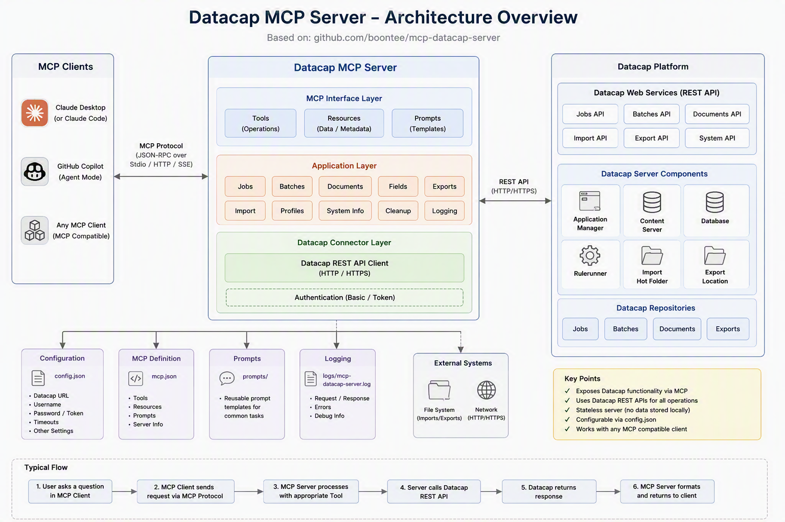

# mcp-datacap-server

An MCP (Model Context Protocol) server for the **IBM Datacap 9.1.10 REST API**. Exposes Datacap batch queue management, transaction-based rule execution, and application configuration as MCP tools consumable by any MCP-compatible AI assistant.

**Version:** 1.2.0



---

## Requirements

- Node.js 18+
- IBM Datacap 9.1.10 with the REST API (`/service`) enabled
- TypeScript 5+ (dev only)

---

## Installation

```bash
npm install
npm run build
```

---

## Configuration

All configuration is via environment variables. Defaults target a local Datacap install.

| Variable | Default | Description |
|----------|---------|-------------|
| `DATACAP_URL` | `http://localhost:82/service` | Datacap REST API base URL |
| `DATACAP_APP` | `APT` | Default application name when `application` param is omitted |
| `DATACAP_USER` | `admin` | Datacap login username |
| `DATACAP_PASSWORD` | `admin` | Datacap login password |
| `DATACAP_STATION` | `1` | Datacap station ID |
| `DATACAP_ROOT` | `C:\Datacap` | Root folder for Datacap application files on the server |

### Bob MCP config example

```json{
  "mcpServers": {
    "datacap-mcp-server": {
      "command": "npx",
      "args": [
        "-y",
        "git+https://github.com/boontee/mcp-datacap-server"
      ],
      "env": {
        "DATACAP_URL": "http://<datacapserver_url>/ServiceWTM.svc",
        "DATACAP_APP": "watsonxai",
        "DATACAP_USER": "admin",
        "DATACAP_PASSWORD": "admin",
        "DATACAP_ROOT": "C:\\Datacap"
      },
      "disabled": false
    }
  }
}
```

---

## File Path Shorthand

Any tool that accepts a file path supports the `@apps\` shorthand, which is automatically resolved to `DATACAP_ROOT\`:

```
@apps\watsonxai\images\Input\BOL_001.tif
→ C:\Datacap\watsonxai\images\Input\BOL_001.tif
```

---

## Tools

### Application & Configuration

#### `list-applications`
List all Datacap applications registered in the Task Manager.

#### `get-workflow`
Get the workflow hierarchy (workflows → jobs → tasks) for a Datacap application.

| Parameter | Required | Description |
|-----------|----------|-------------|
| `application` | No | Datacap application name |

#### `get-task-profiles`
List all task profiles (ruleset execution profiles) defined in an application. Optionally resolve the rulesets for a specific profile.

| Parameter | Required | Description |
|-----------|----------|-------------|
| `application` | No | Datacap application name |
| `taskProfile` | No | Profile name to resolve rulesets for |

#### `get-dco-list`
List all SetupDCO document hierarchy definitions for an application.

#### `get-dco-definition`
Get the full SetupDCO XML definition (document types, page types, fields).

| Parameter | Required | Description |
|-----------|----------|-------------|
| `application` | No | Datacap application name |
| `dcoName` | No | DCO name — usually same as application name |

#### `get-task-list`
Flat list of all tasks with IDs and job info. Use to discover valid `taskName` values for `create-batch`.

#### `get-fingerprint-list`
List fingerprint templates registered for a page type.

| Parameter | Required | Description |
|-----------|----------|-------------|
| `application` | No | Datacap application name |
| `pageType` | **Yes** | Page type name (e.g. `InvoicePage`) |
| `dcoName` | No | DCO name |

---

### Batch Queue Management

#### `list-batches`
List batches with optional filters and pagination.

| Parameter | Required | Description |
|-----------|----------|-------------|
| `application` | No | Datacap application name |
| `pageSize` | No | Batches per page (default 20, max 100) |
| `pageIndex` | No | Page index starting at 1 |
| `sortColumn` | No | Sort column e.g. `qu_id`, `qu_batch`, `qu_status` |
| `filter` | No | Filter expression e.g. `qu_status==\|pending` |

#### `get-batch`
Get attributes and status of a specific batch by queue ID.

#### `get-batch-history`
Get the processing history (task progression log) for a batch.

#### `get-page-file`
Get the current DCO page file (XML with extracted field values and batch state) for a batch.

#### `create-batch`
Create a new batch and set it to running status. `jobName` and `taskName` must match entries from `get-workflow`.

| Parameter | Required | Description |
|-----------|----------|-------------|
| `application` | No | Datacap application name |
| `jobName` | **Yes** | Workflow job name (e.g. `Demo`) |
| `taskName` | **Yes** | Task name to start at (e.g. `VScan`) |

#### `upload-file`
Upload a TIFF or PDF image to an existing grabbed batch.

| Parameter | Required | Description |
|-----------|----------|-------------|
| `queueId` | **Yes** | Batch queue ID |
| `filePath` | **Yes** | Absolute path to the image file on the server |
| `application` | No | Datacap application name |

#### `grab-batch`
Grab a pending batch and set it to running.

#### `grab-next-batch`
Grab the next available pending batch for a given job and task automatically. Returns `-1` if none available.

| Parameter | Required | Description |
|-----------|----------|-------------|
| `jobName` | **Yes** | Job name |
| `taskName` | **Yes** | Task name |
| `application` | No | Datacap application name |

#### `release-batch`
Release a grabbed batch back to the queue.

| Parameter | Required | Description |
|-----------|----------|-------------|
| `queueId` | **Yes** | Batch queue ID |
| `status` | **Yes** | `finished` \| `hold` \| `cancelled` \| `aborted` \| `offline` |
| `application` | No | Datacap application name |

#### `queue-set-file`
Upload or replace a file on an existing grabbed batch (must be in `running` status).

#### `delete-batch`
Permanently delete a batch and its folder. **Irreversible.**

#### `get-statistics`
Get processing statistics for an application.

| Parameter | Required | Description |
|-----------|----------|-------------|
| `application` | No | Datacap application name |
| `stat` | No | `counts` \| `by-task` \| `avg-time` \| `age` \| `all` (default) |

---

### Transaction (Stateless Rule Execution)

Transactions run rulesets on a file without creating a persistent batch record in the queue.

#### `transaction-run` ⭐
**One-shot pipeline** — runs the full lifecycle in a single call:
`Logon → Start → SetFile (page XML) → SetFile (image) → Execute → GetFile → End → Logoff`

| Parameter | Required | Description |
|-----------|----------|-------------|
| `imagePath` | **Yes** | Absolute path to the image on the server |
| `application` | No | Datacap application name |
| `taskProfile` | No* | Task profile name to auto-resolve rulesets (e.g. `WebTransaction`) |
| `rulesets` | No* | Comma-separated ruleset names (alternative to `taskProfile`) |
| `pageFileName` | No | Page ID assigned to the image (default `TM000001`) |
| `extraFiles` | No | Additional file names to fetch after execute e.g. `["tm000001", "tm000001c"]` |

\* Either `taskProfile` or `rulesets` must be provided.

Returns `VScan.xml` (classification + field results), optionally `TM000001-Extract.json` (raw LLM output), and any requested `extraFiles`.

#### `transaction-start`
Start a new transaction session. Returns `transactionId` and `wTmId`.

| Parameter | Required | Description |
|-----------|----------|-------------|
| `application` | No | Datacap application name |
| `wTmId` | No | Existing session cookie to reuse (skips Logon) |

#### `transaction-set-page-xml`
Upload a DCO page XML string directly into a transaction workspace.

| Parameter | Required | Description |
|-----------|----------|-------------|
| `transactionId` | **Yes** | Transaction GUID from `transaction-start` |
| `xmlContent` | **Yes** | Full DCO XML e.g. `<B id="Transaction"><V n="TYPE">AppName</V><P id="TM000001">...</P></B>` |
| `fileName` | No | Page file name without extension (default `VScan`) |

#### `transaction-set-file`
Upload a file (image or XML) into a transaction workspace. Images are sent as `multipart/form-data` using the `fileName` parameter as the filename (not the source path basename).

| Parameter | Required | Description |
|-----------|----------|-------------|
| `transactionId` | **Yes** | Transaction GUID |
| `fileName` | **Yes** | Destination name without extension (e.g. `TM000001`) |
| `fileExt` | **Yes** | Extension without dot (e.g. `tif`, `xml`) |
| `filePath` | **Yes** | Absolute path to the source file on the server |

#### `transaction-execute`
Execute rulesets within a transaction.

| Parameter | Required | Description |
|-----------|----------|-------------|
| `transactionId` | **Yes** | Transaction GUID |
| `pageFile` | No | Page file name with extension (default `VScan.xml`) |
| `taskProfile` | No* | Task profile name to auto-resolve rulesets |
| `rulesets` | No* | Comma-separated ruleset names |

#### `transaction-get-file`
Retrieve a file from the transaction workspace after execution.

| Parameter | Required | Description |
|-----------|----------|-------------|
| `transactionId` | **Yes** | Transaction GUID |
| `fileName` | No | File name without extension (default `VScan`) |
| `fileExt` | No | Extension without dot (default `xml`) |

**Typical call sequence after execute:**
1. `fileName=VScan, fileExt=xml` — classification result
2. `fileName=TM000001-Extract, fileExt=json` — raw LLM extraction JSON
3. `fileName=tm000001, fileExt=xml` — DCO field data with character positions

#### `transaction-end`
End a transaction and release server resources. Always call this when done.

| Parameter | Required | Description |
|-----------|----------|-------------|
| `transactionId` | **Yes** | Transaction GUID to end |
| `keepAlive` | No | Skip Logoff to keep session open for inspection; returns `wTmId` for reuse |

---

## Common Patterns

### Quick classification + extraction (one call)
```
transaction-run
  application = watsonxai
  imagePath   = C:\Datacap\watsonxai\images\Input\invoice.tif
  taskProfile = WebTransaction
```

### Manual transaction (inspect at each step)
```
transaction-start  →  transaction-set-page-xml  →  transaction-set-file (image)
→  transaction-execute  →  transaction-get-file (VScan.xml)
→  transaction-get-file (TM000001-Extract.json)  →  transaction-end
```

### Keep session alive for log inspection
```
transaction-end  keepAlive=true
→ inspect RRS log at C:\Datacap\<app>\logs\<wTmId>\
→ transaction-start  wTmId=<returned wTmId>   ← reuses same session
```

### Process a batch through the queue
```
create-batch (jobName, taskName)
→  upload-file (queueId, filePath)
→  release-batch (queueId, status=finished)
```

---

## Ruleset Name Normalisation

When resolving rulesets from `collection.xml` via a task profile, the server automatically renames:

```
transaction.ai_Data_Extraction  →  watsonx.ai_Data_Extraction
```

This normalisation is case-insensitive and applied to the resolved ruleset string before execution.

---

## Development

```bash
npm run dev      # watch mode (tsc --watch)
npm run build    # production build → build/index.js
```

Source: [`src/index.ts`](src/index.ts)  
Entry point: [`build/index.js`](build/index.js)
